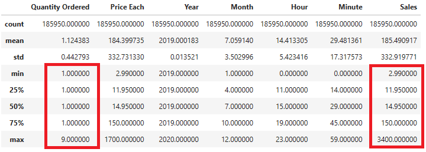
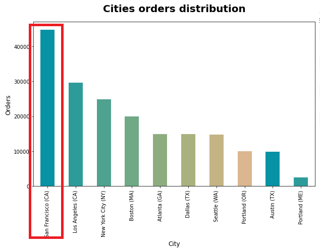
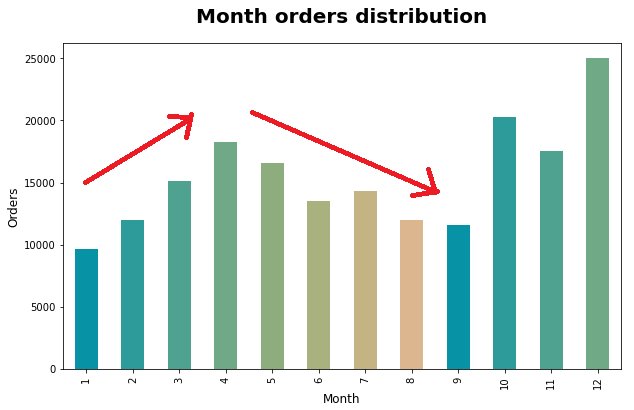
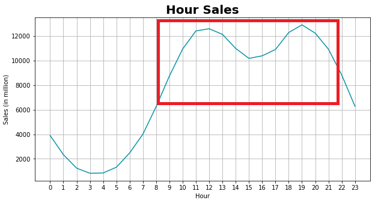
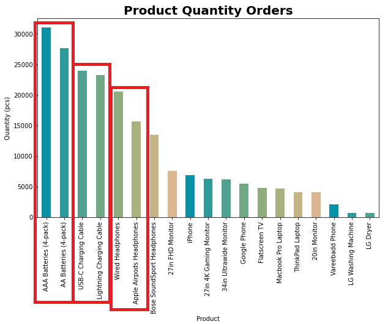
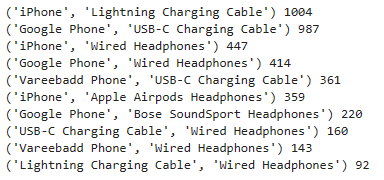
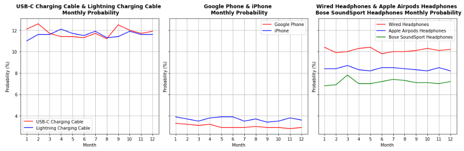

# About the project
Bluemazon is an e-commerce that focuses on selling electronic items. The company has run the business for several years and wants to improve its sales strategy. They want to analyze 2019 sales and generate insights about the top-performing and underperforming products, the problems in selling and market opportunities, and revenue-generating sales activities.


# Goals and Objective
  * Goal
    - Generate insight and recommendations based on 2019 sales data.
  * Objective
    - Process datasets to a usable form
    - Analyze data and create recommendations.


## Built with
- [![Python][Python.com]][Python-url]
- [![Jupyter][Jupyter.com]][Jupyter-url]
- <a href="https://pandas.pydata.org/">
    
  </a>

- <a href="https://matplotlib.org/stable/index.html">
    
  </a>
- <a href="https://seaborn.pydata.org/index.html">
    
  </a>
## Prerequisites
* Pandas
  ```sh
  pip install pandas
  ```
* Matplotlib
  ```sh
  pip install matplotlib
  ```
* Seaborn
  ```sh
  pip install seaborn
  ```

## Resources
For more detailed dataset information visit <a href='https://www.kaggle.com/datasets/knightbearr/sales-product-data?datasetId=1695352&sortBy=voteCount'>kaggle</a> page.

# Data Processing
Available data contains 12 CSV files for monthly sales data. Datasets were concatenated and resulting in 186,850 orders data. The dataset contains 545 null values and some unmatch feature data types. Extract some features such as month, day, hour, city, and sales.
# Data Analysis
## Descriptive Analysis



Customers mostly order 1 item at once, some small groups order 2 items at once, highest orders are for 9 items at once. Sales for each order are in the range of 2.99 to 3400. Distribution for sales and Price Each is relatively the same because most quantity order is 1.

Summary sales 2019, total revenue <b>34,483,365.68 USD, 185,916 orders and 209,038 items sold.</b>

## Univariate Analysis



Most of the orders are from California (CA), San Francisco, and Los Angeles with more than 40,000 and 30,000 orders. Average orders in cities are around 18,000 orders.



High order months include December, with 25,000 orders, and October, with 20,000 orders. From January to April, pattern orders increase; from May to September, they drop.

## Multivariate Analysis



Sales are at their highest from 9:00 to 21:00. This pattern can be a fantastic place to advertise items to boost sales.



The top product sold is Battery products, then followed by Charging cable, and Headphones.

# Insight and Recommendation

1. Product Combination <br>
There are some frequent combinations of products in customer order behavior. Most of the combinations are in the: 

    

    - Phone product + Charging cable 
    - Phone product + Headphone
    - Charging cable + Headphone

    This data can support to make product bundling to increase sales of specific products.

2. Rush Hour <br>
Sales are at their greatest between 9:00 and 21:00. This indicates that most customers tend to place orders during this time period. This peak may be a good place to advertise advertising.


    

This data can be supported to post more ads on the rush hour time span.

3. Order Probability <br>
Charging cables have relatively the same probability. iPhone has a higher probability than Google Phone. Wired Headphones have the highest order probability on headphones product type.

    

    This data can support having more product stock and marketing on higher product order probability.


[Python.com]: https://img.shields.io/badge/python-000000?style=for-the-badge&logo=python&logoColor=white
[Python-url]: https://www.python.org/
[VScode.com]: https://img.shields.io/badge/vscode-000000?style=for-the-badge&logo=visual-studio-code&logoColor=white
[VScode-url]: https://code.visualstudio.com/
[Jupyter.com]: https://img.shields.io/badge/jupyter-000000?style=for-the-badge&logo=jupyter&logoColor=white
[Jupyter-url]: https://jupyter.org/
[Selenium.com]: https://img.shields.io/badge/selenium-000000?style=for-the-badge&logo=selenium&logoColor=white
[Selenium-url]: https://www.selenium.dev/
[BS.com]: https://img.shields.io/badge/Beautifulsoup-000000?style=for-the-badge&logo=&logoColor=white
[BS-url]: https://www.crummy.com/software/BeautifulSoup/bs4/doc/
[pandas.com]: https://pandas.pydata.org/
[pandas-url]: https://img.shields.io/badge/pandas-000000?style=for-the-badge&logo=&logoColor=white
[matplotlib.com]: https://matplotlib.org/stable/index.html
[matplotlib-url]: https://img.shields.io/badge/matplotlib-000000?style=for-the-badge&logo=matplotlib&logoColor=white
[seaborn.com]: https://seaborn.pydata.org/index.html
[seaborn-url]: https://img.shields.io/badge/seaborn-000000?style=for-the-badge&logo=seaborn&logoColor=white
